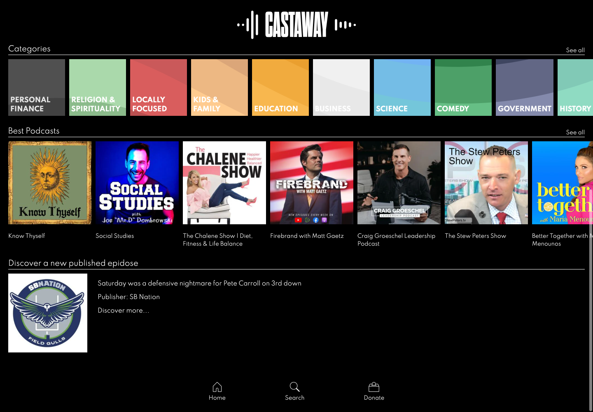
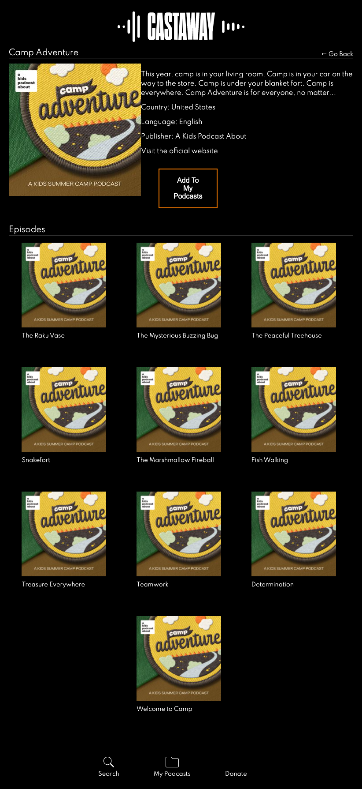
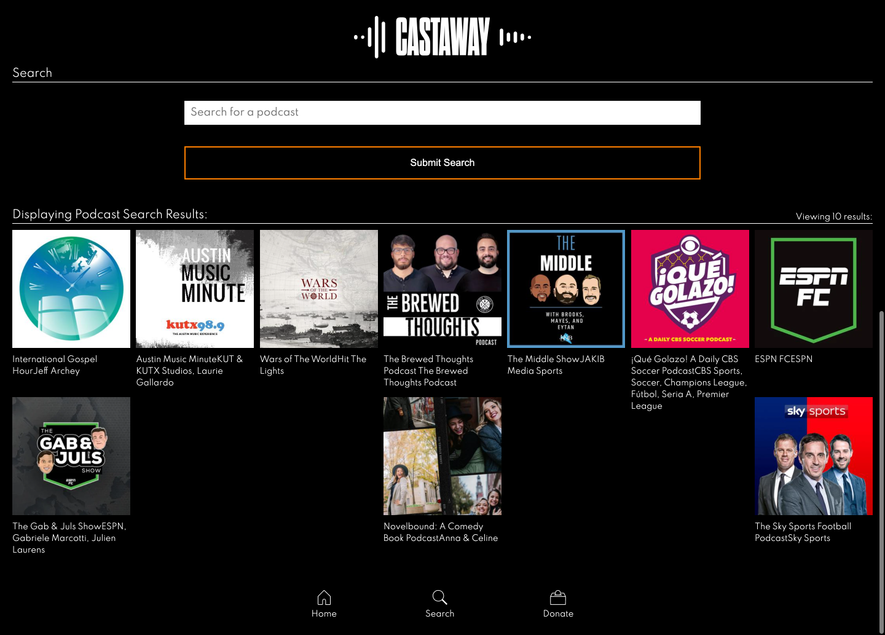
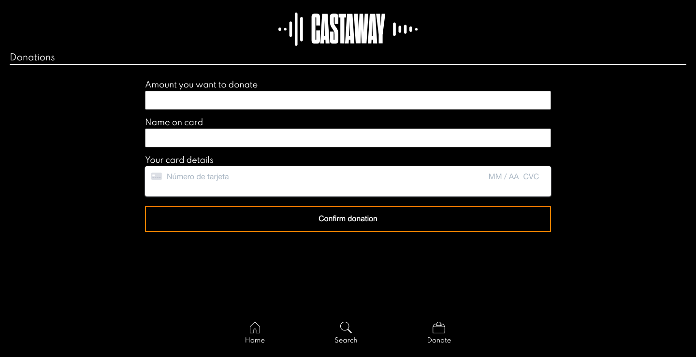
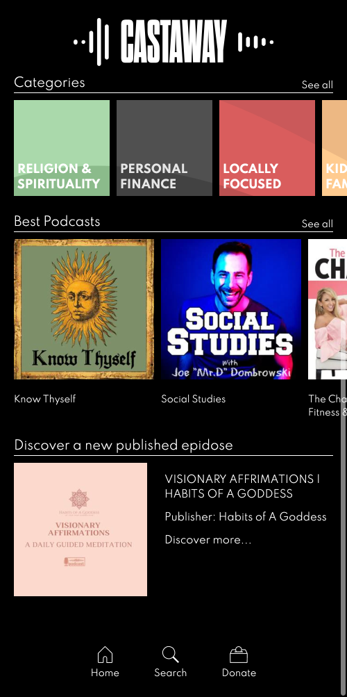

# Team 3, Project 3: Castaway App

## Table of Contents

- [Description](#description)
- [Installation](#installation)
- [Usage](#usage)
- [Technologies Used](#technologies)
- [Contributing](#contributing)
- [Tests](#tests)
- [Questions](#questions)
- [License](#license)

## Description

Castaway, is a podcasting app designed to make more podcasting more accessible to a growing market. Excluding all other types of media, it's an app exclsuively about podcasting. 

Decluttering the overwhelming choice of many podcasting and streaming apps, Castaway offers a simple yet intuitive design, that ensures picking a podcast has never been easier. 

Discover a podcast from the GENRE you know you're in the mood for. SEARCH for a specific topic that's on your mind. Or keep up to date with the NEWEST & MOST POPULAR podcasts that are currently trending. The app places the focus on these key functionalities to help users spend less time searching, and more time listening. 

Each dyanmically rendered podcast is primed with additonal information including the podcast title, thumbnail, description, publisher, release date and more to help advise your choice. 

Each podcast also has a built-in audio player for immediate listening. 

Once users find the perfect podcast, they can save it to their personal MyPodcast library. 

An exclusive service for subscribers only, just sign up and login and escape to a paradise of podcasting. 

Free-to-use, if users like what they see and hear, there is also the option to 'donate' to the project, as facilitated by the integration of Stripe.

The app has a mobile-first design, built with REACT and enhanced by HTML, Javascript and CSS. 

It features a sleek user interface, with a customised header (featuring the Castwaway logo), and accessible navigation bar, featuring the Search, Donate and My Podcast icons.

User data is stored using a MERN stack set up, with Apollo Server and graphQL. 

Email validation upon sign-up prevents duplciation of accounts, whereas checks on login also ensure security of user accoutns. 

It has been deployed on Heroku, using AtlasDB.

Screenshots of the app are also included below.

## Installation

The app works in any browser at the deployed Heroku link included.

However, to install the project please clone the repo from GitHub and use the following package manager:

* Enter 'npm init' and 'npm i' in the terminal to install all packages.

* Or please ensure all dependencies and dev dependencies are installed individually (npm install {package}).

- Dependencies: apollo-server-express, brcrypt,concurrently, graphql, podcast-api, react-modular-audio-player, react-router-dom, react-select, jsonwebtoken, mongoose, nodemon, stripe, graceful-fs, react, react-dom, react-scripts,  connect-session sequelize, dotenv, express, express-handlebars, express-session, mysql2, nodemon, sequelize.

## Usage

* Download and install NPM packages (as above).

* Then please enter the commands 'npm run build' or 'npm run develop' to launch the app locally on port 3000 (localhost:3000) in the browser. 

* The app uses Concurrently to action both client and server.

## Technologies

* The app uses a REACT front-end design. 

* The back-end support is provided by MongoDB and the Mongoose ODM to allow user input to be stored in a database on login and while selecting podcasts to be saved to their MyPodcast library. 

* It uses GraphQL with a Node.js and Express.js server.

* The App makes use of the [Listen Notes](https://www.listennotes.com/) third party API to retrieve podcast library data, depending on user selection. 

* The React Modular audio player enables use of a built-in audio player for immediate listening each audio file. 

* Queries and mutations are used to retrieve and add user data upon login and signup. 

* The app has been deployed using Heroku (with connection to AtlasDB).

* The polished mobile-first design and responsive UI is faciitated by custom CSS.

* React router set up is employed to enhance navigation and interactivity, with the app accepting and respond to user requests.

* Authentication via JWT tokens auth-middleware and brcrypt hashing provides security for the user data upon signing up and logging in.

* Sensitive information such as the API keys are protected in local-only environment files.

* The payment platform Stripe is integrated to allow users to make donations to the project.

## Contributing

To contribute further on this project please contacts the repo owners at the GitHub account below. 

## Tests

Further testing with the Jest package are proposed for future development.

## Questions

For any further questions, please contact GitHub users:
[Thom Williams](https://www.github.com/ThomWilliams/)
[Raul Sanz](https://github.com/itsraulsanz)
[Temi Lanre-Adewumi](https://github.com/TemyTemy)

Or for direct enquiries please email the follower developer address:
thomwilliams1990@gmail.com

## Screenshots

## Deployment / Links

- Deployed App: [Heroku](https://castaway-podcast-app.herokuapp.com/)

- Project Repository: [GitHub](https://github.com/ThomWilliams/castaway-app)

- Issue tracker: [GitHub Issues](https://github.com/ThomWilliams/castaway-app/issues)

## License

MIT

Copyright (c) [2021] [Castaway-App]

Permission is hereby granted, free of charge, to any person obtaining a copy
of this software and associated documentation files (the "Software"), to deal
in the Software without restriction, including without limitation the rights
to use, copy, modify, merge, publish, distribute, sublicense, and/or sell
copies of the Software, and to permit persons to whom the Software is
furnished to do so, subject to the following conditions:

The above copyright notice and this permission notice shall be included in all
copies or substantial portions of the Software.

THE SOFTWARE IS PROVIDED "AS IS", WITHOUT WARRANTY OF ANY KIND, EXPRESS OR
IMPLIED, INCLUDING BUT NOT LIMITED TO THE WARRANTIES OF MERCHANTABILITY,
FITNESS FOR A PARTICULAR PURPOSE AND NONINFRINGEMENT. IN NO EVENT SHALL THE
AUTHORS OR COPYRIGHT HOLDERS BE LIABLE FOR ANY CLAIM, DAMAGES OR OTHER
LIABILITY, WHETHER IN AN ACTION OF CONTRACT, TORT OR OTHERWISE, ARISING FROM,
OUT OF OR IN CONNECTION WITH THE SOFTWARE OR THE USE OR OTHER DEALINGS IN THE
SOFTWARE.
